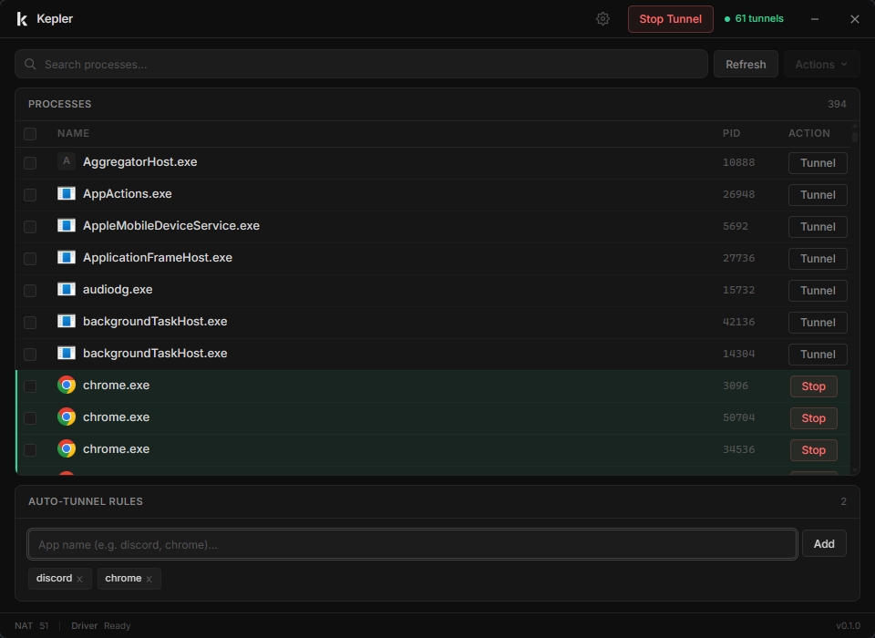
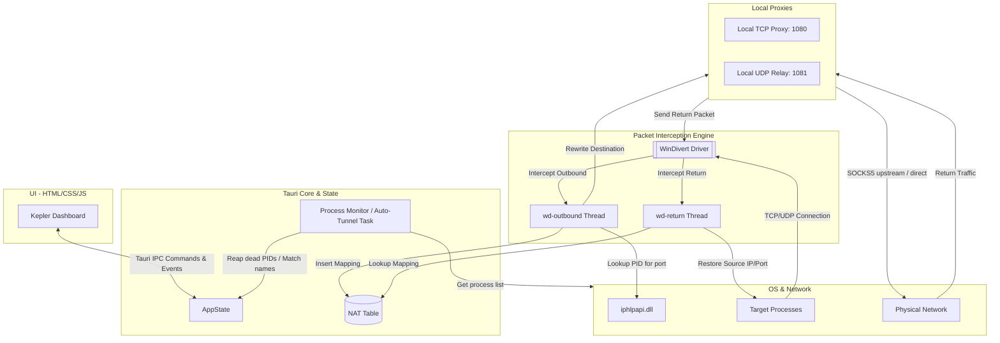
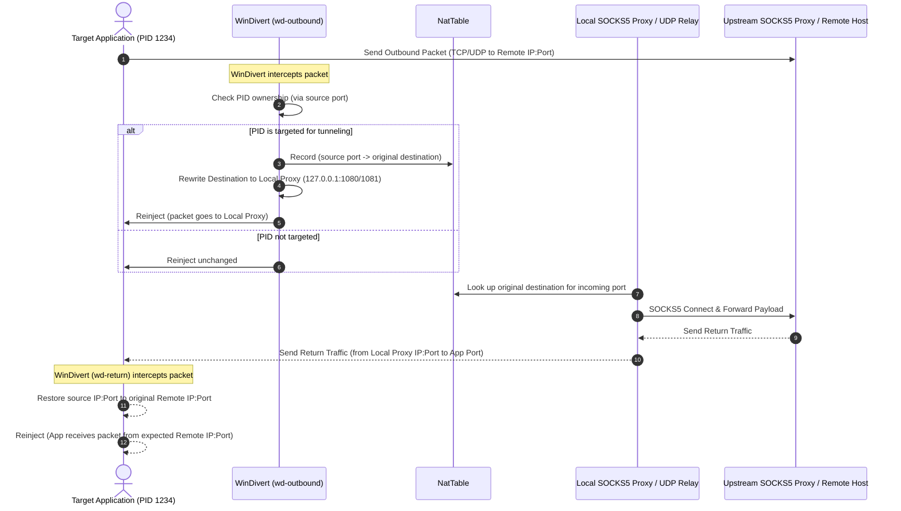

# Kepler

Kepler is a high-performance, per-app network tunnel for Windows. It allows users to route network traffic of specific Windows processes (applications) through an upstream SOCKS5 proxy using WinDivert kernel packet interception.





## Features

- **per-app tunneling**: target specific applications (by pid or process name) for proxying without affecting other system traffic.
- **auto-tunnel rules**: define rules to automatically catch and tunnel new instances of apps as they launch.
- **kernel-level interception**: uses windivert to intercept, modify, and reinject packets at the network layer.
- **local proxy/relay**: running local tcp proxy and udp relay servers to handle connections transparently.
- **socks5 support**: connects to external upstream SOCKS5 proxies with optional username/password authentication.

## Packet Journey



### 1. Outbound Traffic (`wd-outbound`)
- Outbound packets are intercepted by WinDivert.
- The thread queries the OS connection table (`iphlpapi.dll`) to find the PID that owns the source port.
- If the PID matches a targeted app or auto-tunnel rule:
  1. The original destination `(remote_ip:remote_port)` is recorded in the `NatTable`.
  2. The packet destination is rewritten to point to our local proxy (`127.0.0.1:1080` for TCP, `127.0.0.1:1081` for UDP).
  3. Checksums are recalculated, and the packet is reinjected into the network stack.

### 2. Local Proxy & Upstream Forwarding
- The local TCP proxy/UDP relay server receives the rewritten packet.
- It looks up the original destination from the `NatTable`.
- The connection is handshaked and tunneled through the upstream SOCKS5 server (`socks5.rs`).

### 3. Return Traffic (`wd-return`)
- Returning packets from the local proxy/relay are intercepted.
- The original destination is looked up to restore the packet's source address.
- The packet is rewritten so the application believes it came directly from the remote server, maintaining connection integrity.

## Prerequisites

- **windows OS**
- **administrator privileges**: WinDivert requires admin access to load its driver.
- **WinDivert binaries**: The application expects `WinDivert.dll` and `WinDivert64.sys` in the working directory (supplied under `src-tauri/resources/windivert`).

## Getting Started

### 1. Installation

1. **Install Node.js** (v20+ recommended).
2. **Install Rust** via [rustup.rs](https://rustup.rs/).
3. Clone this repository and install NPM dependencies:
   ```bash
   npm install
   ```

### 2. Running in Development Mode

Since Kepler utilizes `WinDivert` to intercept network packets at the kernel level, the application **must be run with Administrator privileges**.

1. Open your terminal of choice (PowerShell, Command Prompt, or terminal emulator) as **Administrator**.
2. Start the development environment:
   ```bash
   npm run tauri dev
   ```

### 3. Production Builds

To compile and package a production-ready build:

1. Compile the installers (MSI and NSIS EXE):
   ```bash
   npm run tauri build
   ```
2. Find the generated installers under:
   `src-tauri/target/release/bundle/`

---

## Code Signing & Auto-Updates

Kepler supports secure auto-updates on startup, checking against releases hosted on GitHub. To enable build signing:

1. **Generate a signing keypair**:
   ```bash
   npx tauri signer generate --ci
   ```
2. Add the generated private key to your GitHub repository secrets named `TAURI_SIGNING_PRIVATE_KEY`.
3. The public key is embedded in `tauri.conf.json`. When you push a tag matching `v*` (e.g., `v0.1.2`), the GitHub Actions release workflow compiles, signs the binary, and attaches the update files alongside the `latest.json` updater manifest to the release page.

## Project Structure

```text
├── src/                  # frontend code (html, css, js)
├── src-tauri/
│   ├── capabilities/     # app capabilities definitions
│   ├── icons/            # tray & window icons
│   ├── resources/        # windivert driver files (.sys/.dll)
│   ├── src/
│   │   ├── divert.rs     # windivert safe handle wrapper
│   │   ├── lib.rs        # tauri main orchestration & commands
│   │   ├── main.rs       # app entry point
│   │   ├── nat.rs        # thread-safe nat table
│   │   ├── pid_lookup.rs # os socket-to-pid resolution
│   │   ├── process_list.rs # system process enumerator
│   │   ├── proxy.rs      # local tcp/udp redirection servers
│   │   ├── socks5.rs     # socks5 rfc client implementation
│   │   ├── state.rs      # global app state
│   │   └── tunnel.rs     # windivert thread loops
│   ├── build.rs          # tauri cargo build script
│   └── tauri.conf.json   # tauri config
```
